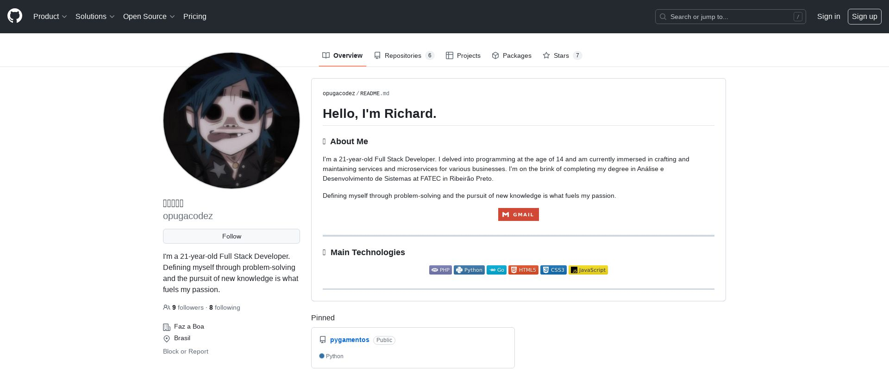

  

# Web Screenshot Service

  

This Flask application provides a simple API for capturing screenshots of web pages using Pyppeteer, a Python library which provides a high-level API to control headless Chrome or Chromium over the DevTools Protocol.

## Example
```bash
curl -X GET \
  'http://localhost:5000/?targetUrl=https://github.com/opugacodez&Width=1200&Height=800&TimeOut=5.0&intervalInside=1.0&intervalOutside=1&screenshot=1'
```



## Installation

### Prerequisites

  

- [Python 3.x](https://www.python.org/)

- [Docker](https://www.docker.com/)

  

1. Clone the repository:

```bash
git  clone  https://github.com/opugacodez/web-screenshoter.git
```

2. Container up:

```bash
docker-compose  up  -d
```

  

## Usage

  

### Endpoint

  

-  **URL**: `/`

-  **Method**: `GET`

  

### Request Parameters

  

-  `targetUrl` (required): The URL of the web page to capture.

-  `Width` (optional, default: 800): The width of the browser window.

-  `Height` (optional, default: 600): The height of the browser window.

-  `TimeOut` (optional, default: 5.0): The time in seconds to wait after loading the page before capturing the screenshot.

-  `intervalInside` (optional, default: 1.0): The time in seconds to wait between each screenshot when capturing multiple screenshots.

-  `intervalOutside` (optional, default: 1): The number of times to repeat the capturing process.

-  `screenshot` (optional, default: 1): The number of screenshots to capture.

### Response

  

-  **Success**: Returns a JSON object with the base64 encoded image in the `response` field.

-  **Error**: Returns a JSON object with an error message and a corresponding HTTP status code.

-

## Code Structure

  

-  `__init__.py`: Main Flask application file containing routes and logic for handling screenshot requests.

-  `requirements.txt`: List of Python dependencies required by the application.

-  `assets/images/`: Directory where captured screenshots are stored.

  

## Dependencies

  

- Flask: Web framework for building the API endpoints.

- Pyppeteer: Python library for controlling headless Chrome or Chromium.

- asyncio: Library for writing asynchronous code using the async/await syntax.

  

## License

  

This project is licensed under the MIT License - see the LICENSE file for details.
